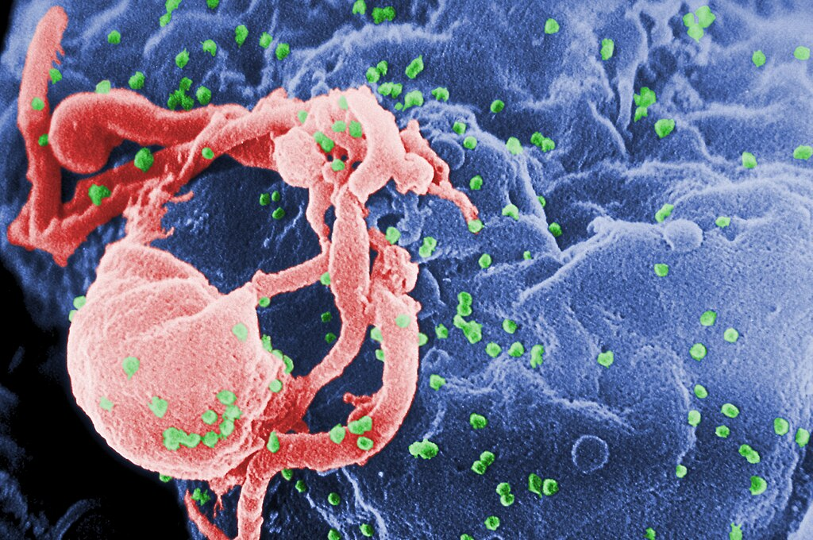

# 🧪 HIV Trends and Indicators: Malaysia, ASEAN, and Global Perspective

  

  
  
  

---

## 🌍 Overview and Introduction

This data management project delves into HIV trends and key indicators across **Malaysia**, **ASEAN countries**, and the **global landscape**. Utilizing comprehensive datasets from WHO and other reputable sources, the analysis offers insights into the progression of the HIV epidemic, treatment coverage, and mortality rates over time.

---

## 📁 Dataset Overview

**Primary Data Sources:**

- World Health Organization (WHO) HIV Data: 14 Datasets

**Key Indicators Analyzed:**

- Estimated number of PLHIV  
- New HIV infections per 1,000 uninfected population  
- Number of people receiving ART  
- HIV-related mortality rates  
- Percentage of HIV-positive results returned to individuals

---

## 🎯 Objectives

1. To analyze temporal trends in key HIV indicators (people living with HIV, new infections, deaths, and ART coverage) in Malaysia and ASEAN countries from 2000 to 2023.
2. To compare HIV epidemic patterns across ASEAN countries and WHO regions, highlighting disparities in prevalence, ART coverage, and mortality.
3. To assess gender differences in new HIV infection rates and evaluate the impact of ART coverage on HIV-related deaths. 
4. To analyze HIV-related indicators among children and pregnant women, including ART coverage, prevention of mother-to-child transmission, and treatment outcomes.
---

## 🧹 Data Cleaning & Preparation

**Steps Undertaken:**

- Handled missing values through imputation or exclusion, as appropriate.  
- Standardized country and indicator names for consistency.  
- Converted data types to ensure accurate computations.  
- Merged datasets from multiple sources to create a unified analytical framework.

---

## 📈 Analysis & Visualizations

**Key Visual Insights:**

### 📌 HIV Trends in Malaysia Living with HIV Deaths ART Coverage and New Infections (Normalized) 

> .png)

Illustrates the rise or decline in the number of PLHIV in Malaysia from 2000 to 2023.

### 📌 Estimated Number of People Living with HIV in ASEAN (2000-2023)

> .png)

Illustrates the rise or decline in the number of PLHIV across ASEAN from 2000 to 2023.

### 📌 Estimated Number of People Living with HIV by WHO Region (2023)

> .png)

Illustrates the rise or decline in the number of PLHIV across different regions on 2023.

### 📌 Others Insight 

- Malaysia HIV Survivorship Death Rate and ART Coverage (Over Time)
- New HIV Infections per 1000 by Sex and Difference (Male-Female) in Malaysia
- Reported HIV Test Volumes and HIV positive Result Return Rates in Malaysia (2022-2023)
- HIV Impact on Children and Pregnant Women in Malaysia
- ART Coverage (%) among People Living with HIV in ASEAN
- HIV related Deaths in ASEAN Countries
- HIV Prevalence (% of Adults Aged 15-49) in ASEAN (2023)
- Correlation between ART coverage and death in ASEAN
- HIV Key Indicators in ASEAN (2000-2023)
- Number of People Dying from HIV related Causes by WHO Region (2000-2023)
- ART Coverage Among People Living with HIV by WHO Region (2000-2023)

---

## 🧩 Key Challenges

- Data discrepancies across different countries and years.  
- Incomplete datasets requiring careful handling of missing values.  
- Variations in data reporting standards among countries.

---

## ✅ Conclusion

- Significant progress has been made in increasing ART coverage, leading to reductions in AIDS-related deaths.  
- However, disparities persist among ASEAN countries, necessitating targeted interventions.  
- Continuous monitoring and data-driven policies are essential to combat the HIV epidemic effectively.

---

## 🧠 Tools & Libraries Used

| Tool            | Purpose                        |
|-----------------|--------------------------------|
| `pandas`        | Data manipulation              |
| `numpy`         | Numerical computations         |
| `matplotlib`    | Data visualization             |
| `seaborn`       | Statistical data visualization |
| `jupyter`       | Interactive coding environment |

---

## 🧑‍💻 Author

**Azrul Zulhilmi bin Ahmad Rosli**  
📘 STQD 6014 Data Science — Semester 1, 2024/2025  
👩‍🏫 Lecturer: Dr. Bernard

---

## 📚 References

1.	Aliza, L.N., Hatta, M., Amierul, M., Pan, S., Hazrin, M., Tee, G., & Hiong. 2019. HIV Among Men Hacing Sex With Men In KUALA LUMPUR From Integrated Bio-behavioural Survey. *Journal of Health Management*, 2. 
2.	Apenteng, O. O., Osei, P. P., Oduro, B., Kwabla, M. P., & Ismail, N. A. 2020. The impact of implementing HIV prevention policies therapy and control strategy among HIV and AIDS incidence cases in Malaysia. *Infectious Disease Modelling*, 5, 755–765. 
3.	Huang, M. & Hussein, H. 2004. The HIV/AIDS Epidemic Country Paper: Malaysia. *AIDS Education and Prevention*, 16(supplement_a). 100–109.
4.	Luis, H., Fridayantara, W. D., Mahariski, P., Wignall, F. S., Irwanto, I., & Gedela, K. 2020. Evolving ART crisis for people living with HIV in Indonesia. *The Lancet HIV*, 7(6).
5.	Malaysia GAM Report 2024. 2024. Global AIDS Monitoring Country Progress Report - Malaysia. *Ministry of Health Malaysia Disease Control Division*, 
6.	Reuters. 2025. What to know about Thailand’s same-sex marriage law. Reuters.
7.	Seekaew, P., Pengnonyang, S,. Jantarapakde, J., Sungsing, T., Rodbumrung, P., Trachunthong, D., Cheng, C.L., Nakpor, T., Reankhomfu, R., Lingjongrat, D., Janyam, S., Charoenying, S., Mills, S., Cassell, M., Phanuphak, P., Vannakit, R., Phanuphak, N., 2018. Characteristics and HIV epidemiologic profiles of men who have sex with men and transgender women in key population-led test and treat cohorts in Thailand. *PLoS One*, 13(8).
8.	Singh, D., Chawarski, M. C., Schottenfeld, R., & Vicknasingam, B. 2013. Substance abuse and the HIV situation in Malaysia. *Journal of Food and Drug Analysis*, 21(4), S46–S51. 
9.	Times, N. S. 2025. 90pct of HIV cases in Malaysia are men, majority in their 20s. NST Online; New Straits Times. 
10.	WHO. 2023. HIV data and statistics. 
11.	Wong, L.P. & Syuhada A.R.N. 2011. Stigmatization and discrimination towards people living with or affected by HIV/AIDS by the general public in Malaysia. *The Southeast Asian Journal of Tropical Medicine and Public Health*, 42(5)
12.	WorldBank. 2025. International Development, Poverty and Sustainability. *World Bank Group*, Worldbank.org. 

---

- 🔭 More deep insight can code work can be seen on [HIV Analysis](https://github.com/azrulzulhilmi/Dashboard)
